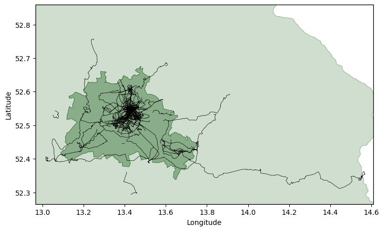

# Map and GPX trace renderer
Python tool to render GPX traces and maps.

----

<figure>
  
  <figcaption>Screenshot of possible output, Berlin and Brandenburg, using <code>./gpx-draw.py --autoscale 512 --bbox 12.96541 14.61085 52.265024 52.858841 --geojson ../../Docs/GeoJSON/de-federal-states-from-overpass-export.geojson  "#00500030" "#00500080" --source_folder ../../Docs/OutdoorActive\ GPX/ --output berlin-brandenburg.png --maxavgspeed 20</code></figcaption>
</figure>

----

<figure>
  
  <figcaption>Screenshot of possible output, Germany and surrounds. Administrative boundaries, which is why the coastline looks wrong.</figcaption>
</figure>

----

<figure>
  
  <figcaption>Screenshot of possible output, Cycling along the EuroVelo Rhine route</figcaption>
</figure>
